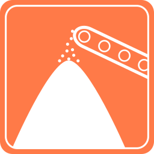

[](https://gitter.im/floriank/saltmine?utm_source=badge&utm_medium=badge&utm_campaign=pr-badge&utm_content=badge)

[](https://circleci.com/gh/floriank/saltmine)


# Saltmine

This is Saltmine - an attempt to modularize Redmine and in particular the OpenProject fork of it. While being able to fork OpenProject again, I will not consider this as the technical goal should be to provide a modularized system which enforces a microservice architecture from the beginning.

Saltmine will be written in GoLang - its frontend will be provided by a different repository.

## Development Setup

- Setup Go properly - currently we use the latest stable. There are currently some problems with `go-1.5rc1` recgarding `goconvey`
- Install [`godep`](https://github.com/tools/godep):

```bash
go get -u github.com/tools/godep
```

- Clone the repo:

```bash
# You can and should use a fork
git clone git@github.com:florian/saltmine $GOPATH/src/github.com/floriank/saltmine
```

- Restore the dependencies

```bash
# You can and should use a fork
cd $GOPATH/src/github.com/floriank/saltmine && godep restore
```

- there is a `Makefile` included for common tasks
- (Optional) If you want to use more fancy testing, go ahead and install [`goconvey`](https://github.com/smartystreets/goconvey):

```bash
go get -u github.com/smartystreets/goconvey
```

It's compatible with the `go test` command, however, it will start a server and you can visit its (very beautiful) testrunner [here](http://localhost:8080).

It's also included in the `Godeps`, however, it dioes not yet properly work (for me at least), i.e. it picks up the tests for the `Godeps`, which is not desirable.

## Private repo?

This is private until there is something presentable.

## Current goals

- [ ] introduce basic models for Project, Tickets and users

## Long term goals

- [ ] provide a fully open sourced modularized project collaboration tool based on services
- [ ] provides an easily deployable solution via containers
- strong integration:
    - [ ] Github/GitLab
    - [ ] Wunderlist
    - [ ] Evernote
    - [ ] BitBucket
    - [ ] CI systems
- [ ] provide a migration script from Redmine/OpenProject to Saltmine

## Even longer term goals

This is stuff I miss from Redmine and OP which would be neat if we can have that:

- [ ] Full [WAI](http://www.w3.org/WAI/) compliance from the start with the support of a component model in the frontend
- [ ] Fuzzy menu to quickly change to another part of the application
- [ ] Watchable objects (not only tickets)
- [ ] mentioning people - and using Markdown in tickets FFS
- [ ] project sharing between instances
- [ ] cross-project pull requests (from a single ticket, merge related PRs of multiple repositories at the same time)

### Notes on migration

Migration would be a killer feature to provide for users to switch to Saltmine. There are some points discussed as of yet:

- Migration would only be partially possible, as not all features are compatible
- Textile content would be converted to Markdown (`pandoc` can do this)
